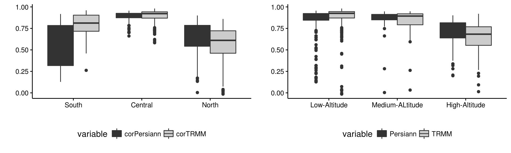
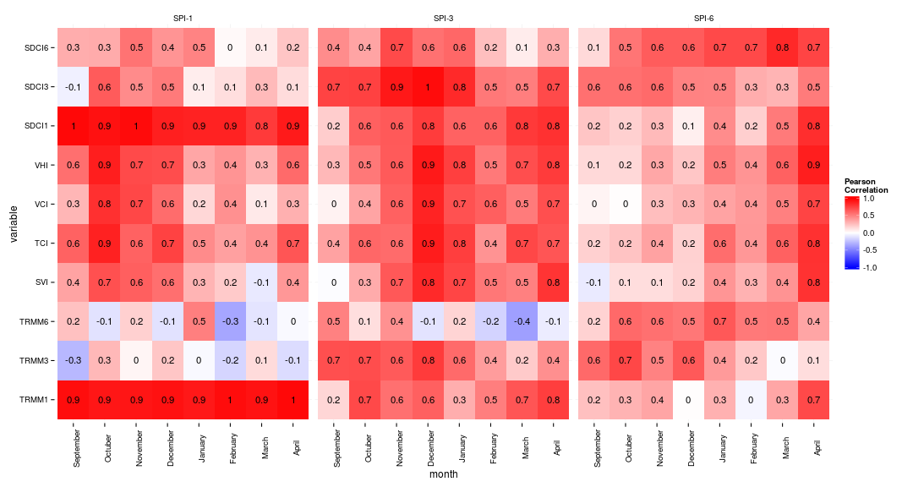
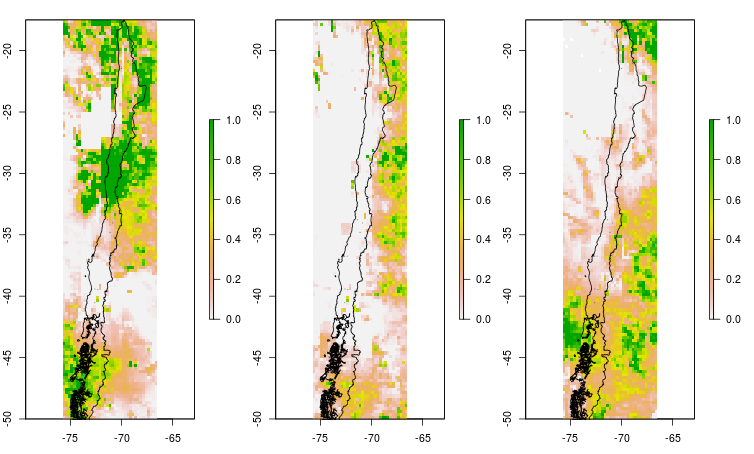

## Characterization of agricultural drought in Chile

<small> [Francisco Zambrano Bigiarini](http://frzambra.github.io)  </small>

<script src="http://ajax.googleapis.com/ajax/libs/jquery/1.9.1/jquery.min.js"></script>

*** =pnotes

Some notes on the first slide

--- &vertical

## Context of drought in Chile

***

>- The last years Chile has been affected for different level of drought.
>- In early 2015 in Chile unusual drought conditions occurred, the central-south part of Chile was affected for drought a situation almost unprecedented.
>- On March 2015 in Chile were 194 administrative units (county) declarated under drought conditions (56% of whole country)
>- According with the fifth report of the IPCC
  - there is an increase in global temperatures. 
  - a decrease of precipitation is expected in central-south Chile.
  - a increase of droughts frequency 
>- Main problems in Chile:
  - low density of weather stations
  - there is a lack of knowledge of the impact of rainfall deficits in agriculture

--- &vertical

## Hypothesis 

</q>
It is possible to develop a merging remote sensing products of precipitation and evapotranspiration locally using in-situ data and so improve the spatial and temporal characterization of agricultural drought in Chile

---

## Objectives

>1. Develop a merging remote sensing product of precipitation and evapotranspiration with monthly frequency from 2000 to 2015 for the watersheds of rivers Limari, Itata y Bueno.
>2. Derive drought indices based on vegetation, land surface temperature, precipitation and evapotranspiration and assess the combined effect.
>3. Perform the characterization of agricultural drought


--- &vertical

## Study area

***

## Limarí river basin

```{r, 'area_estudio_limari', echo=FALSE, warning=FALSE,cache=FALSE,results='asis'}
cat('<iframe src="./assets/widgets/area_estudio_cuenca_limari.html" width=100% height=500 allowtransparency="true"> </iframe>')
```

***

## Itata river basin

```{r, 'area_estudio_itata', echo=FALSE, warning=FALSE,cache=FALSE,results='asis'}
cat('<iframe src="./assets/widgets/area_estudio_cuenca_itata.html" width=100% height=500 allowtransparency="true"> </iframe>')
```

***

## Bueno river basin

```{r, 'area_estudio_bueno', echo=FALSE, warning=FALSE,cache=FALSE,results='asis'}
cat('<iframe src="./assets/widgets/area_estudio_cuenca_bueno.html" width=100% height=500 allowtransparency="true"> </iframe>')
```

--- &vertical

## Methodology

***

## Remote sensing data

- MODIS (Vegetation)
  - **MCD12Q1** (IGBP) : Landcover Type, 1km, yearly, 2001 - 2013.
  - **MOD13A3**  : NDVI, 1km, monthly, 2000 - 2015. 
  - **MOD11A2** : LST, 1km, 8 days, 2000 - 2015
  - **MOD16** : $ET_0$, 1km, monthly, 2000 - 2015
- Precipitation
  - **TRMM 3B43 v7**: Precipitation, 0.25&deg; , monthly, 1998 - 2015
  - **Persiann-CDR** : Precipitation, 0.25&deg; , daily, 1983 - 2015
  - **CHIRPS 2.0** : Precipitation, 0.05&deg; , monthly, 1981 - 2015

***

## Meteorological stations

- From the data base of Center for Science for Climate and Resilience (CR2) from the University of Chile (http://www.cr2.cl).
  - Precipitation : 781 station with daily and monthly data
  - Extreme temperatures : 281 stations

***

## Merging

To improve the accuracy of the precipitation and evapotranspiration (ET) remote sensing products merging techniques will be used.

- Regression-Kriging (RK) : Spatial prediction of the in-situ measurements using the remote sensing product as predictor and additional information.
- Bayesian combination.

***

## Derivation of drought indices

### 2000 - 2015

- **Standardized vegetation index (SVI) :** From NDVI (MOD13A3) the standardized anomaly was calculated as:

$$SVI = \frac{NDVI -\overline{NDVI}}{NDVI_\sigma}$$

- **Vegetation condition index (VCI) :** The time series of NDVI images was smoothed using a locally-weighted polynomial regression (LOWESS), then:

$$VCI = \frac{NDVI - NDVI_{min}}{NDVI_{max}-NDVI_{min}}$$

***

## Derivation of drought indices

### 2000 - 2015

- **Temperature condition index :** The Land Surface Temperature (LST) images of 8 days was converted to monthly and then:

$$TCI = \frac{LST_{max} -LST}{LST_{max}-LST_{min}}$$

- **Vegetation health index :** Combines the response of vegetation and land surface temperature

$$VHI = 0.5\cdot VCI + 0.5 \cdot TCI$$

***

## Derivation of drought indices

### 1983/1998 - 2015

- **Precipitation Condition Index (PCI):** this index was/will calculated for monthly accumulated precipitation of 1, 3 and 6 months using the remote sensing precipitation products.

$$PCI = \frac{PP_{rs}-PP_{rs}_{min}}{PP_{rs}_{max}-PP_{rs}_{min}}$$

- **Scaled Drought Condition Index (SDCI) :** this index was calculated using the three time scales of PCI (1, 3 and 6)

$$SDCI = 0.5\cdot PCI + 0.25 \cdot TCI + 0.25 \cdot VCI$$

***

## Derivation of drought indices

### 1983/1998 - 2015

- **Standardized Precipitation Index ($SPI_{rs}$) :** with the resulting precipitation from the mergin procedure it would be possible to derive an a spatial SPI.

- **Standardized Precipitation Evapotrasnpiration Index ($SPEI_{rs}$) :** with the resulting precipitation and evapotranspiration from the mergin procedure it would be possible to derive an a spatial SPEI.

***

## Data analysis

- Exploratory data analsis od the derived indices
- Different statistics to compare merging products.
- Point to point correlation between vegetation/temperture indices and precipitation.
- Maximum Covariance Analysis (MCA) between pair of indices vegetation/temperature, vegetation/precipitation and precipitation/temperature 

--- &vertical

## Preliminary results

***

### Persiann-CDR/TRMM 3B43 v7 vs in-situ 

<div style='text-align: center;'>
    
</div>

<div style='text-align: center;'>
    
</div>

***

### Correlation between indices in the Itata river basin

<div style='text-align: center;'>
    
</div>


***

### Comparison between indices in Chile on March 2015

PCI-1, PCI-3 and PCI-6

<div style='text-align: center;'>
    
</div>

***

### Comparison between indices in Chile on March 2015

SVI, TCI, VCI and VHI

<div style='text-align: center;'>
    
</div>


---

## The end

### Thanks

---

## RVL.IO

If you don't like writing slides in HTML you can use the online editor [rvl.io](http://rvl.io).

---

## Works in Mobile Safari

Try it out! You can swipe through the slides and pinch your way to the overview.

---

## Marvolous Unordered List

- No order here
- Or here
- Or here
- Or here

---

## Fantastic Ordered List

1. One is smaller than...
2. Two is smaller than...
3. Three!

--- #transitions

## TRANSITION STYLES
You can select from different transitions, like: 

```{r echo = F, results = 'asis', comment = NA}
transitions = c("cube", "page", "concave", "zoom", "linear", "fade", "none", "default")
names(transitions) = gsub("^([a-z])", "\\U\\1", transitions, perl = TRUE)
x = sprintf("[%s](?transition=%s#/transitions)", names(transitions), transitions)
cat(paste(x, collapse = ' - '))
```

--- #themes

## Themes

Reveal.js comes with a few themes built in: 

```{r echo = F, results = 'asis', comment = NA}
themes = c("sky", "beige", "simple", "serif", "night", "default", "solarized", "moon")
names(themes) = gsub("^([a-z])", "\\U\\1", themes, perl = TRUE)
x = sprintf("[%s](?theme=%s#/themes)", names(themes), themes)
cat(paste(x, collapse = ' - '))
```

<small>* Theme demos are loaded after the presentation which leads to flicker. In production you should load your theme in the `<head>` using a `<link>`.</small>

--- ds:alert &vertical

## Global State
Set `data-state="something"` on a slide and "something" will be added as a class to the document element when the slide is open. This lets you apply broader style changes, like switching the background.

<a href="#" class="image navigate-down">
  
</a>

*** ds:blackout

## Blackout

<a href="#" class="image navigate-down">
  
</a>

*** ds:soothe

## Soothe

<a href="#" class="image navigate-next">
  
</a>

--- ds:red &vertical

## Custom Soothe Styles

*** ds:orange

## Orange

*** ds:yellow

## Yellow

*** ds:green

## Green

*** ds:blue

## Blue

*** ds:indigo

## Indigo

*** ds:violet

## Violet

*** ds:brown

## Brown

---

## Custom Events

Additionally custom events can be triggered on a per slide basis by binding to the data-state name.

```
Reveal.addEventListener( 'customevent', function() {
  console.log( '"customevent" has fired' );
} );
```

---

## Clever Quotes

These guys come in two forms, inline:  <q>The nice thing about standards is that there are so many to choose from and block:</q>

> For years there has been a theory that millions of monkeys typing at random on millions of typewriters would reproduce the entire works of Shakespeare. The Internet has proven this theory to be untrue.

---

## Pretty Code

```
function linkify( selector ) {
  if( supports3DTransforms ) {

    var nodes = document.querySelectorAll( selector );

    for( var i = 0, len = nodes.length; i < len; i++ ) {
      var node = nodes[i];

      if( !node.className ) ) {
        node.className += ' roll';
      }
    };
  }
}
```

Courtesy of [highlight.js](http://softwaremaniacs.org/soft/highlight/en/description/)

---

## Intergalactic Interconnections

You can link between slides internally, [like this](#/2/3).

---

## Fragmented Views

Hit the next arrow...

.fragment ... to step through ...

> - any type
> - of view
> - __fragments__

---

## Take a Moment

Press b or period on your keyboard to enter the 'paused' mode. This mode is helpful when you want to take distracting slides off the screen during a presentation.


---

## Incremental Paragraphs

.fragment This is paragraph 1 and should appear on first click.

.fragment This is paragraph 2 and should appear on second click.

.small [Back to the Beginning](#/0)


---

## Title

This is a slide

- point 1
- point 2
- point 3

---

## Incremental Reveal

These points should be animated

> - Point 1
> - .highlight-red Point 2
> - .grow Point 3

<script>
$('ul.incremental li').addClass('fragment')
</script>


---

## Code with slide

```{r eval = T}
library(ggplot2)
qplot(wt, mpg, data = mtcars)
```

--- &vertical ds:soothe

## Vertical Slides

The next set of slides will be vertical slides.

***

## Slide 1

This is slide 1

***

## Slide 2

<iframe src='http://www.statdistributions.com' width = '960px' height = '600px'></iframe>

